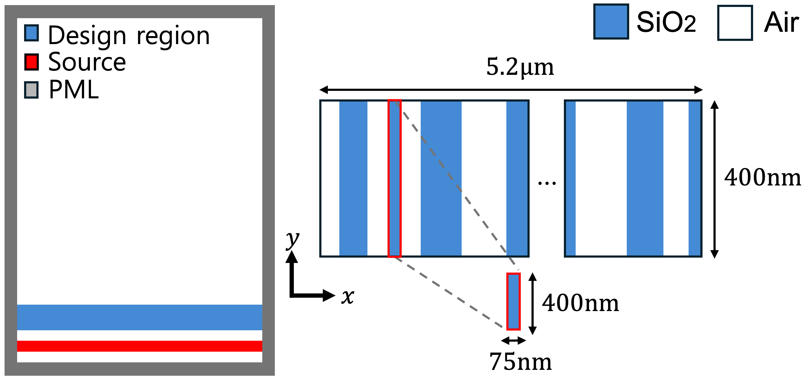

# Simulation Setup



FDFD simulation setup overview. (left) The entire simulation space includes the metalens structure. The blue region represents the design region of the lens, red line represents the visible light source, and the gray region represents the PML used to minimize reflections. (right) The design region of the metalens, shown as the blue area in (left).


we utilize Ceviche library, an open-source FDFD simulation tool, to generate electromagnetic field data for photonic structures. Specifically, we analyze the field of a metalens structure, simulating only half of the cylindrical symmetry lens to reduce computation time. We implement the FDFD simulation with a grid-based approach at a spatial resolution of 40 points per $\mu m$. The simulation domain measures 5.2 $\mu m \times$ 6.85 $\mu m$, excluding a 1-$\mu m$ thick perfectly matched layer (PML) at the boundaries.

We use SiO2, a material commonly employed in the design of metalenses. As demonstrated in the above figure (left), we randomly place either SiO2 or air within the minimum design grid size, a width of 75nm, in the design area. This simulation setup generates data for the E and H fields when visible light passes through the structure.

As shown in the main instruction `README.md`, you can conduct the EM simulation through the below bash.
```bash
python simulation.py
```
If you prepare the dataset using this simulation, the dataset will be created automatically in the default path.
